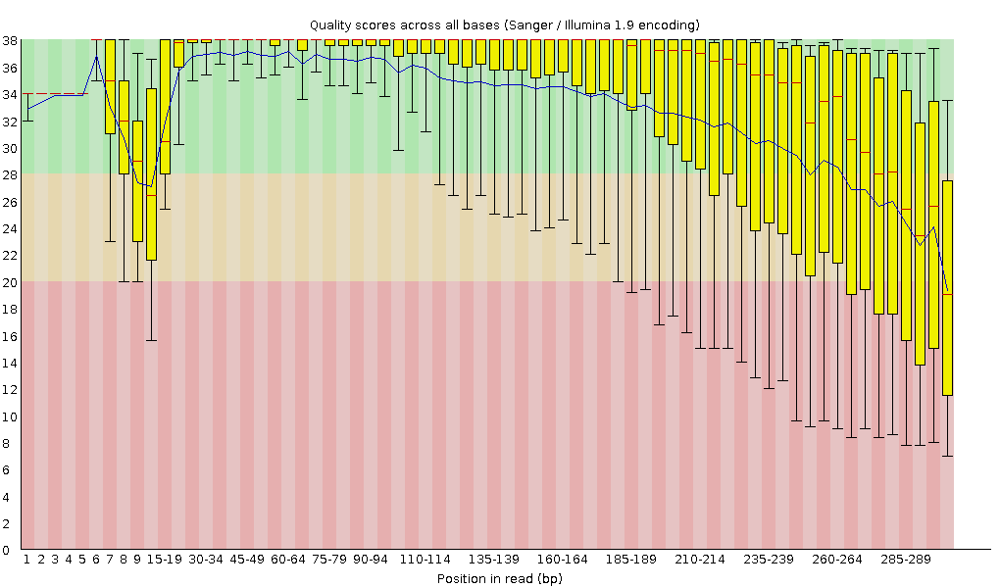
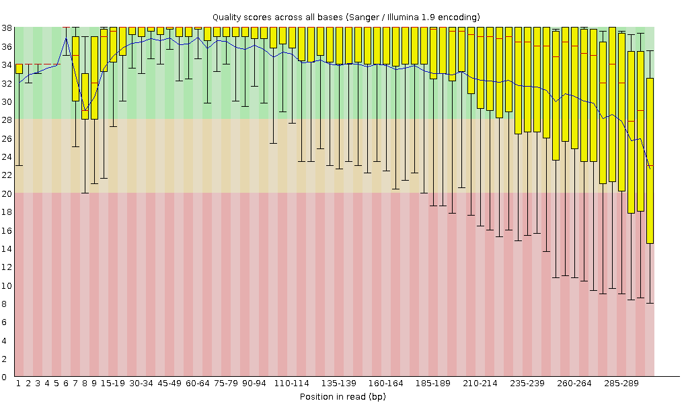

```{r setup, include = FALSE}
knitr::opts_chunk$set(echo = FALSE, warning = FALSE, message = FALSE, error = FALSE)
```

```{r load-packages}
# load general-use packages
library("dplyr")
library("tidyr")
library("knitr")
library("ggplot2")
library("lubridate")
library("forcats")

# These are the primary packages well use to clean and analyze the data
# this package needs to be installed from bioconductor -- it's not on CRAN
# see info here: https://benjjneb.github.io/dada2/dada-installation.html
library("dada2")

# And this to visualize our results
# it also needs to be installed from bioconductor
library("phyloseq")
```

``` {r add melted phyloseq}
# load in the saved phyloseq object to work with
load("output/phyloseq_obj.Rda")

# make melted phyloseq
# melt phyloseq obj into a data frame for dplyr/ggplot
# analysis and visualization
melted_phyloseq <- psmelt(phyloseq_obj)

# turn all factor columns into character columns for dplyr
melted_phyloseq <- melted_phyloseq %>%
  mutate_if(is.factor, as.character)

##########################################
# Make plot ID's more readable
##########################################

phyloseq_obj@sam_data[["plotID"]] <- substring(phyloseq_obj@sam_data[["plotID"]], 6, 8)
melted_phyloseq$plotID <- substring(melted_phyloseq$plotID, 6, 8)
```

``` {r add blast data}
# read curated summary data in from csv
blast_results <- read.csv("output/curatedSummary.csv")
# flip the order of the data so the genus comes first
top_10_genus_blast <- blast_results[, c(2, 1)] %>%
  arrange(desc(count)) %>%
  head(10)

# read curated data on top 5 in from csv
top_5_genus <- read.csv("output/top5blast.csv")

# mutate the data frame to split scientific name into genus and species
top_5_genus$genus <- gsub(" .*$", "", top_5_genus$Scientific.Name)
top_5_genus$species <- gsub(".* ", "", top_5_genus$Scientific.Name)
```
<!-- word count: 385 words -->

# Introduction

<!--Overview of soil bacterial communities (400 words)-->
<!--ACTUAL: 80 words -->

Microscopic organisms are among the oldest and most prevalent lifeforms on earth. Accordingly, they play a vital role in the health of ecosystems by affecting processes like carbon dioxide and nitrogen cycling [@martiny]. As the worlds climate changes over time understanding how microbes influence the dynamics of ecosystems will be necessary to preserve the environment. Currently, the impacts of climate change on the biogeochemical cycling of microbes are not well understood [@barnard]. However, some research suggests microbes may be able to mediate carbon-cycle feedbacks to climate warming [@zhou]. 

Due to their importance in the function and stability of ecosystems, the biodiversity of microorganisms is vital to the overall diversity of macroscopic organisms. Typically the first objective of many ecological research projects is to determine the which organisms are present and their bio-geography [@zimmerman]. Previous research suggests the distribution of microbes is heterogeneous and spatially-structured [@maron]. Thus, accurate sampling of a wide variety of plots is necessary to understanding how microbes influence a large ecosystem. 

For the microbial community, identifying distinct species is particularly difficult [@koeppel]. Recent advances in molecular biology, including high-throughput sequencing has allowed for genetic identification of microbial species without culturing them. Many researchers use amplicon sequencing of the 16S rRNA gene as a bio-marker for the microbial community [@tringe]. 

<!--Overview of NEON -> My site including UNDERC (300 words)-700 -->
<!--ACTUAL: 166 words-->

The National Science Foundation (NSF) funded National Ecological Observation Network (NEON) was designed to answer how the ecosystem and it's components respond to changes in climate? [@keller] To this aim NEON collects microbial samples in soil from a number of sites across the United States. I will investigate the UNDE site, near the Great Lakes in Michigan.
The UNDE site is managed by the University of Notre Dame Environmental Research Center (UNDERC). The property has a second-growth Northern mesic forest and Evergreen forests. The dominant species are red and sugar maple (*Acer rubrum* and *A. saccharum*), aspen (*Populus tremuloides*), paper birch (*Betula papyrifera*), balsam fir (*Abies balsamea*), cedar (*Thuja occidentalis*), and black spruce (*Picea mariana*). In addition to the deciduous and mixed forests the site has woody wetlands dominated by thicks of alder (*Alnus incana*).

The climate is generally humid, cool, and wet with no true dry season and receives approximately 114 inches of snow annually. The soil families include coarse, loamy, mixed, superactive, frigid, argic fragiaquods.

Before the land was donated to the Notre Dame University in the 1930s, region-wide logging for pine cut most of the forested areas on the property. Timber harvest continued into the 1950s, but was followed by a forest regrowth. Recently, the site is used for recreational, educational, and research goals.

<!--Approach (200 words)-900 -->

The objective of this study is to determine which microbes are present at the UNDE site, using the 16S barcode sequence, and how this changes over time. This information provides insight into how these ecosystems respond to climate change and their overall health and function.

The UNDE site has 1192 samples containing sequencing data from soil microbes. The data collected by NEON will be processed for quality control, sub-sampled, trimmed, converted to fasta format and compared to NCBI's nucleotide database using the BLAST algorithm. The matches to the nucleotide database will be used to make inferences on the type of microbial organisms present.

<!--Major findings (150 words)-1050 -->

The data set contained a large number of high quality sequences. I found *Ralstonia solanacearum* was the most frequent BLAST match with a few matches with a query cover of 100%. The finding of *Ralstonia solanacearum* is important because this could indicate a soil-borne plant pathogen on the UNDE site.

# Methods
<!--TARGET: 500 words -1550 total -->
<!--ACTUAL: 488 words -->

<!-- 45 words-->
NEON collected and sequenced the samples from the UNDE site, all data can be found in data product DP1.10108.001 (https://data.neonscience.org/data-products/DP1.10108.001) [@NEON]. I analyzed the samples which were formatted and uploaded by NEON to make inferences on the microbial sequences present in each sample over time.

## Sample Collection

<!-- 103 words -->
Each site contains ten plots that are further sampled one to three times per year. NEON randomly selects three locations for each sample event, with each sampling location is not re-sampled. Soil sampling is collected to a maximum depth of thirty centimeters. After collection, samples are stores in sterile containers, frozen and shipped to a lab for downstream analysis. 
In the lab, DNA is extracted and the samples are prepared for high-throughput sequence analysis using primers for 16S sequences. The sequences are delivered to NEON for quality control and acceptance. After acceptance, NEON formats and uploads the files in repositories for public use.

## Analysis

<!-- Overview/general outline of analysis approach -->
<!-- 84 words -->
I downloaded all unique 16S files for the UNDE site from the NEON database. Then, I checked each files quality using fastqc. I sub-sampled each file to make the dataset computationally tractable. I trimmed each file in order to capture high quality reads and converted the fastq files to fasta files. Next, I compared each fasta file to a nucleotide database to make inferences on which microorganisms were present in the samples from the UNDE site. 

Finally, I used those BLAST results to BLANK!!! FILL THIS IN!!!!

### Downloading Data

<!-- 71 words -->
I downloaded all unique files for the target gene 16S from the NEON database for the UNDE site. The script to download the data used the R library neonUtilities and the NEON API to download the data product. I used the data product ID DP1.10108.001. In addition, I downloaded the metadata for the raw data to include information on when the data was collected and where the data was collected from.

### Fastqc

<!-- 28 words -->
I extracted the R1 files from their zipped folders. Then, I ran fastqc on each file to assess their quality and identify any problematic files [@fastqc]. 

### Sub-sampling

<!-- 28 words -->
I randomly sub-sampled 0.5% of the sequences in each file to make the data computationally tractable. For this, I used the srand function and the random seed 1234.

### Trimming

<!-- 54 words -->
I trimmed the sub-sampled files using TrimmomaticSE [@trimmomatic]. I used four threads, phred33 base quality encoding, a minimum quality threshold of 5 for both leading and trailing bases, and a minimum length of two-hundred base pairs. Additionally, I implemented a sliding window with window size eight and required quality of twenty-five.

### BLAST

<!-- 80 words -->
I used bioawk (https://github.com/lh3/bioawk) to convert the sub-sampled, trimmed fastq files to fasta files for downstream BLAST analyses. I compared each fasta file to the GenBank's nucleotide database [@benson2000genbank]. I used the BLASTN algorithm, which uses a nucleotide query sequence to search the nucleotide database [@blastn]. I used four threads, the '10 sscinames std' format, and returned one match for each sequence. I excluded 2018-09-19_environmental_sequence.gi to reduce the number of uncultured or environmental matches.

### Analyzing Blast Data

I analyzed the BLAST matches found for each sequence using the seventh bash script in the pipeline. First, I found the 5 BLAST matches which occured most frequently throughout the dataset. Then, I found the top match for each file with a query cover of 100% to include only high quality matches. 

# Results
<!-- 600 words 2150 total -->

## Sequence Counts and Quality

The data set included 1192 fastq files with a range of sequences per file. The maximum number of sequences in a file was 413,851 sequences, while the minimum number of sequences was 118. The average number of sequences in a file was 43,028 sequences. There was a total of 51,289,602 sequences in the data set.

After sub-sampling there was 268,512 sequences total, or approximately .5% of the sequences. The maximum number of sequences after sub-sampling was 2,090, while the minimum was zero. Seven of the files did not have any sequences after sub-sampling. This was about 0.6% of the raw fastq files. 

After trimming there was 154,922 sequences total, or approximately 58% of the sub-sampled sequences. The maximum number of sequences after trimming was 1,213, while the minimum was zero. Nineteen of the files did not have any sequences after sub-sampling. This was about 1.6% of the raw fastq files. files.

Overall, the sequence quality was good. None of the inspected fastqc reports contained sequences flagged as poor quality. Figure 1 shows the fastqc of a file which did not have any sequences after trimming, while Figure 2 shows the fastqc of the file with the most sequences after trimming. The decline in quality scores happens about 50 base pairs later in the better file.



**Figure 1.** Fastqc per base sequence quality for BMI_Plate1WellA1_16S_R1. This was one of the lower quality files and did not have any acceptable sequences after sub-sampling and trimming. You can see a sharp decline on base sequence quality around 210 base pairs.




**Figure 2.** Fastqc per base sequence quality for BMI_Tube52_16S_R1. This was one of the higher quality files. You can't see a sharp decline until approximately 260 base pairs.

## BLAST Results

The five most frequent BLAST matches I found in the data set were *Ralstonia solanacearum*, *Staphylococcus aureus*, *Geobacillus thermocatenulatus*, and *Sphingomonas melonis*.

The top matches I found in each file with a query cover of 100% were *Ralstonia solanacearum*, *Bradyrhizobium elkanii*, *Bacillus sp.*, *Actinomadura sp*, and *Acetobacteraceae bacterium*.

# Discussion
<!-- 500 words 2650 total -->

## Overview

The UNDE site, in Michigan, near the great lakes has a second-growth Northern mesic forest and Evergreen forests with various trees including maple, aspen, birch, cedar, and black spruce. In addition, the site has a woody wetlands dominated by thicks of alder. 

The data collected by NEON from this site was high-quality and contained a substantial amount of genetic information. The collected sequences matched a variety of bacteria widely associated to soil including *Ralstonia solanacearum* and *Acetobacteraceae bacterium*. These two species have very different impacts on plants. *Ralstonia solanacearum* is a plant pathogen while *Acetobacteraceae bacterium* can be found in symbiotic relationships with many different plants by colonizing their internal tissues.

## *Ralstonia solanacearum*

*Ralstonia solanacearumm* is a soil-borne plant pathogen with unusually high prevalence worldwide [@salanoubat2002genome]. This pathogen naturally infects the roots of plants causing bacterial wilt in many plants and crops [@castillo2007evolutionary]. The DNA sequencing of the soil samples from the UNDE site indicate a high probability of *Ralstonia solanacearum*. The workers of UNDERC should look for indications of this pathogen in plants near the sampling sites and take preventative action to protect the biodiversity of the UNDE site.

# Tables and Graphs

``` {r blast table}
# make table
kable(top_10_genus_blast)
```

**Table 1.** Top 10 genus returned from blast results

``` {r blast comparison}
# get top 20 genus
top_10_genus_curated <- melted_phyloseq %>%
  group_by(Genus) %>%
    filter(!is.na(Genus)) %>%
      summarize(sum_abund = sum(Abundance,
                                na.rm = TRUE)) %>%
        arrange(desc(sum_abund)) %>%
          head(10)

colnames(top_10_genus_curated) <- c("Genus",
                          "Abundance")
kable (top_10_genus_curated)
```

**Table 2.** Top 10 genus by abundance from curated database

``` {r detailed blast}
# get top by species w/o Bradyrhizobium and Pseudomonas
top_3_staph_rals_pro <- top_5_genus %>%
  filter (genus != "Bradyrhizobium") %>%
  filter (genus != "Pseudomonas") %>%
  group_by(genus, species) %>%
  tally() %>%
  arrange(desc(n)) %>%
  head(3)
  
# get top 3 of Bradyrhizobium and Pseudomonas
# Bradyrhizobium
top_3_br <- top_5_genus %>%
  filter(genus == "Bradyrhizobium") %>%
  group_by(genus, species) %>%
  tally() %>%
  arrange(desc(n)) %>%
  head(3)

# Pseudomonas
top_3_pseu <- top_5_genus %>%
  filter(genus == "Pseudomonas") %>%
  group_by(genus, species) %>%
  tally() %>%
  arrange(desc(n)) %>%
  head(3)

# bind Bradyrhizobium and Pseudomonas
top_3_bp <- rbind(top_3_br,
                  top_3_pseu)

# graph counts with genus on x and fill species
# Filtered for only the top 10 samples
# Ralstonia was ommitted to make graph more readable
# Proteobacteria didn't have any species
top_3_bp %>%
  filter(n > 10) %>%
  ggplot(aes(x = genus,
             y = n,
             fill = species)) +
  xlab("Genus") +
  ylab("Number of Samples") +
  ggtitle("BLAST Samples by Genus and Species") +
  geom_col(position = position_dodge()) +
  theme(axis.text.x = element_text(angle = 60,
                                   hjust = 1))
```

**Figure 1.**

``` {r detailed-table}
# make a table for other relevant counts
kable(top_3_staph_rals_pro)
```

**Table 3.**

``` {r percent Identity}
# graph boxplot of percent identity by top 5 Genus
top_5_genus %>%
  ggplot(aes(x = genus,
             y = pident)) +
  geom_boxplot() +
  ggtitle("Percent Identity by Genus") +
  xlab("Genus") +
  ylab("Percent Identity") +
  theme_classic() +
  theme(axis.text.x = element_text(angle = 60,
                                   hjust = 1)) +
  geom_hline(yintercept = 90, color = "red")
```

**Figure 4.**

``` {r length}
# graph boxplot of length by top 5 Genus
top_5_genus %>%
  ggplot(aes(x = genus,
             y = length)) +
  geom_boxplot() +
  ggtitle("Length of Sequence Match by Genus") +
  xlab("Genus") +
  ylab("Length of Sequence") +
  theme_classic() +
  theme(axis.text.x = element_text(angle = 60,
                                   hjust = 1)) +
  geom_hline(yintercept = 200, color = "red")
```

**Figure 5.**

``` {r evalue}
# graph boxplot of evalue by top 5 genus
top_5_genus %>%
  filter(evalue < 1) %>%
  ggplot(aes(x = genus,
             y = evalue)) +
  geom_boxplot() +
  ggtitle("Expected Value by Genus") +
  xlab("Genus") +
  ylab("Expected Value") +
  theme_classic() +
  theme(axis.text.x = element_text(angle = 60,
                                   hjust = 1)) +
  geom_hline(yintercept = 0.05, color = "red")
```

**Figure 6.**

``` {r bitscore}
# graph boxplot of bitscore by top 5 genus
top_5_genus %>%
  ggplot(aes(x = genus,
             y = bitscore)) +
  geom_boxplot() +
  ggtitle("Bitscore by Genus") +
  xlab("Genus") +
  ylab("Bitscore") +
  theme_classic() +
  theme(axis.text.x = element_text(angle = 60,
                                   hjust = 1)) +
  geom_hline(yintercept = 200, color = "red")
```

**Figure 7.**

``` {r curated v. uncurated, message=FALSE}
# Number of Samples in top 5 genus when controlled for
# - bitscore above 200
# - e value below 0.05
# - length above 200
# - percent identity above 90%
curated_top_5_totals <- top_5_genus %>%
  filter(bitscore > 200) %>%
  filter(evalue < 0.05) %>%
  filter(length > 200) %>%
  filter(pident > 90) %>%
  group_by(genus) %>%
  tally()

top_5_totals <- top_10_genus_blast %>%
  head(5) %>%
  arrange(genus)

invisible(sort(top_5_totals$genus))

top_5_totals$curated_count <- curated_top_5_totals$n

top_5_totals <- top_5_totals %>%
  arrange(desc(count))

kable(top_5_totals)
```

**Table 4.**

``` {r Samples by year}
##########################################
# Number of Samples
##########################################

# Get number of samples by year, plot, month
sample_info <- melted_phyloseq %>%
  distinct(OTU, .keep_all = TRUE) %>%
  group_by(plotID, collect_year, collect_month) %>%
  tally()

# Graph the number of samples by month, with fill year
sample_info %>%
  ggplot(aes(x = factor(collect_month),
             y = n,
             fill = factor(collect_year))) +
  xlab("Collection Month") +
  ylab("Number of Samples") +
  geom_col(position = position_dodge())
```

**Figure 8.** Number of samples by month

``` {r samples by plot}
# Graph the plots in month 5 and 8
sample_info %>%
  filter(collect_month == 5 | collect_month == 8) %>%
  group_by(plotID, collect_year) %>%
  ggplot(aes(x = plotID,
             y = n,
             fill = factor(collect_year))) +
  xlab("Plot ID") +
  ylab("Number of Samples") +
  ggtitle("Samples by plot in May and August") +
  geom_col() +
  theme(axis.text.x = element_text(angle = 60,
                                   hjust = 1)) +
  theme(legend.position = "top") +
  labs(fill = "Collection Year")
```

**Figure 9.** Number of samples by plot

``` {r kingdom analysis}
kingdom_info <- melted_phyloseq %>%
  filter(!is.na(Kingdom)) %>%
  distinct(OTU, .keep_all = TRUE) %>%
  group_by(Kingdom, collect_year, collect_month) %>%
  tally()

kingdom_info %>%
  ggplot(aes(x = factor(collect_year),
             y = n,
             fill = Kingdom)) +
  geom_col()
```
  
**Figure 10.** Summary of Kingdom found matched in phyloseq. 

``` {r phyla by plot}
# list the top phyla in descending order
phyla_by_plot <- melted_phyloseq %>%
  group_by(plotID, Phylum) %>%
  filter(!is.na(Phylum)) %>%
  summarize(sum_abund = sum(Abundance,
                            na.rm = TRUE)) %>%
  filter(sum_abund > 0) %>%
  arrange(desc(sum_abund))

# keep only the top phyla
top_phyla_by_plot <- phyla_by_plot[!duplicated(phyla_by_plot$plotID), ]

top_phyla_by_plot %>%
  ggplot(aes(x = plotID,
             y = sum_abund,
             fill = Phylum)) +
  geom_col() +
  theme(axis.text.x = element_text(angle = 10)) +
  theme(legend.position = "top")
```

**Figure 11.**

``` {r top 3 phyla by year}
# Phyla by year
# control for
# - month 5 or month 8
# - plots: 001, 006, 008, 037, 038, 043, 044
# look at different phylum abundances

# list of plots to keep
plots <- c('001', '006', '008', '037', '038', '043', '044')

# counts of the top 3 phyla overall, for each of the plots
top_3_diverse_phyla <- melted_phyloseq %>%
  filter(Abundance > 0, !is.na(Phylum)) %>%
  distinct(OTU, .keep_all = TRUE) %>%
  group_by(Phylum) %>%
  tally() %>%
  arrange(desc(n)) %>%
  head(3) %>%
  pull(Phylum)

melted_phyloseq %>%
  filter(collect_month == 5 | collect_month == 8) %>%
  filter(plotID %in% plots) %>%
  group_by(collect_year, Phylum) %>%
  summarize(sum_abund = sum(Abundance,
                            na.rm = TRUE)) %>%
  filter(Phylum %in% top_3_diverse_phyla) %>%
  ggplot(aes(x = factor(collect_year),
             y = sum_abund,
             fill = Phylum)) +
  xlab("Collection Year") +
  ylab("Abundance") +
  geom_col(position = position_dodge())
```

**Figure 12.**

``` {r phyla by month plot 6}
# Phyla by month in plot 6
# top 3 phyla in plot 6
diverse_phyla_plot_6 <- melted_phyloseq %>%
  filter(plotID == '006') %>%
  filter(Abundance > 0, !is.na(Phylum)) %>%
  distinct(OTU, .keep_all = TRUE) %>%
  group_by(Phylum) %>%
  tally() %>%
  arrange(desc(n)) %>%
  pull(Phylum)

melted_phyloseq %>%
  filter(plotID == '006') %>%
  group_by(collect_month, Phylum) %>%
  summarize(sum_abund = sum(Abundance,
                            na.rm = TRUE)) %>%
  filter(Phylum %in% diverse_phyla_plot_6) %>%
  ggplot(aes(x = factor(collect_month),
             y = sum_abund,
             fill = Phylum)) +
  xlab("Collection Month") +
  ylab("Abundance") +
  geom_col(position = position_dodge())
```

**Figure 13.**

``` {r richness by year}
phyloseq_5_8 <- prune_samples(
  phyloseq_obj@sam_data$collect_month == 5 |    
  phyloseq_obj@sam_data$collect_month == 8,
                              phyloseq_obj)

# richness in months 5 and 8 with year as the color
plot_richness(phyloseq_5_8,
              x = "plotID",
              measures = "Shannon") + 
  xlab("Plot ID") +
  geom_point(aes(color = factor(collect_year)))
```

**Figure 14.**

``` {r richness 2016}
phyloseq_2016 <- prune_samples(
  phyloseq_obj@sam_data$collect_year == 2016, 
                               phyloseq_obj)
# richness in 2016
plot_richness(phyloseq_2016,
              x = "plotID",
              measures = "Shannon") + 
  xlab("Plot ID") +
    geom_point(size=2,
               aes(color = factor(collect_month)))
```

**Figure 15.**

# Sources Cited