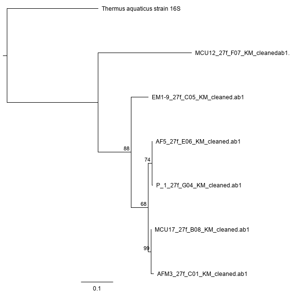

# Background

<!-- Example Citation from Professor Zimmerman

Previous work has looked at the microbial biogeography of university campuses and found high diversity [@ross2015microbial].

-->
I was given 40 sequences of 16S ranging from 5-1,310 bases long in ab1 format. The primary aims of this analysis were to assess sequence usability, quality, and length for the 16S sequences. After cleaning the data, BLAST matches were found against NCBI's GenBank and phylogenetic trees were developed through Maximum Likelihood and Bayesian approaches. The sequences were cleaned conservatively, especially for phylogentic inference, to ensure the integrity of the data. BLAST matches were found for 22 of the 40 sequences. All of the sequences I analyzed were likely to come from the domain Bacteria. I inferred a monophyletic clade of *Staphylococcus* sequences and possibly identified taxa of at least six sequences from the dataset with strong confidence. The six strongest inferences were *Firmicutes* and *Gammaprotobacteria*.

# Methods

<!-- Bulleted list of what was conducted

    -- Clean/Trim Sequences
    -- Sequence usability
        -- Geneious Prime
    -- BLAST
    -- Alignment (MAFFT)
    -- Phylogenies
        -- PhyML
        -- Mr Bayes
        
-->

I sorted each of the 40 sequences into two categories: useable and unusable. The useable sequences were trimmed and cleaned and sorted further into very good and acceptable. The very good sequences were aligned and used to create two phylogenies. The acceptable sequences were matched to the BLAST nucleotide database. 

All data files are in the data folder of this project. The raw data files are contained in raw_data and were not altered during this analysis. Once sequences are analyzed and changed the new files are in sequence_data. The multiple sequence alignment and the geneious files for PhyML and MrBayes alignments are contained in the alignments folder. Both trees are saved as png images in the images folder.

## Sequence Cleaning

I used Geneious Prime (v 2019.2.1) [@kearse2012geneious] to trim, clean, and assess the quality of sequences. Sequences ends were trimmed to reduce low quality on the ends of sequences. Trimming was done conservatively. Bases were trimmed if they contained any baseline contamination, low peaks, messy peaks, or if the peaks began to span multiple nucleotide positions with only one clear peak. After trimming, I assessed the usability of the sequences, separating them into three groups: very good, acceptable, and unusable. Very good sequences had long stretches (more than 100 base pairs) of high quality reads. Very good sequences were cleaned to change any internally miscalled bases and add associated ambiguity codes. Acceptable sequences had mostly high quality reads without long stretches. Poor sequences had some high quality reads, but overall looked messy. Unuseable sequences were either very short (5 base pairs), or had multiple peaks throughout the sequence. 

## Sequence Alignment

I used the MAFFT [@katoh2002mafft] multiple sequence aligner to align the trimmed, very good 16S sequences. The MAFFT settings used were scoring matrix of 200PAM / k=12, gap open penalty of 1.53, and offset value of 0.123. The six sequences were aligned with a 16S sequence from *Thermus aquaticus*. 

## Phylogeny

I used two approaches (Maximum Likelihood and Bayesian) to make phylogenetic inferences of the six very good sequences. 

### Maximum Likelihood
I created a Maximum Likelihood phylogeny using the PhyML algorithm [@guindon2009estimating]. This analysis was ran with General Time Reversible (GTR) substitution model, 100 bootstraps, Gamma and Invariants model, four substitution rate categories, and optimized for topology/length/rate. A 16S sequence from *Thermus aquaticus* was used as an outgroup.

### Bayesian
I built a Bayesian phylogeny using the MrBayes 3.6.2 algorithm [@huelsenbeck2001mrbayes]. This analysis was ran with General Time Reversible (GTR) model, invgamma rate variation, chain length of 1,100,000, 4 heated chains, heated chain temperature of 0.2, subsampling frequency of 200, burn-in length of 100,000, random seed of 23,107, and unconstrained branch lengths with GammaDir(1, 0.1, 1, 1). A 16S sequence from *Thermus aquaticus* was used as an outgroup.

## BLAST

All sequences rated very good, average, or poor were used to search for BLAST matches in NCBI's GenBank database [@benson2000genbank]. All BLAST searches were done using the highly similar sequences (megablast) algorithm. All matches were selected by choosing which species was most represented at the top of the list. 

# Results

## Sequences and Alignments

Of the 40 sequences provided 22 were useable with 16 acceptable for BLAST analysis and 6 good enough to place into a phylogeny. The longest sequence was 907 base pairs after trimming while the shortest was  147. Seven sequences were total fails producing only 5 N's after Sanger sequencing. Another 11 had messy sequences throughout with frequent unidentifiable bases scattered throughout the middle of the sequence. All of the 40 sequences were located in 16S. Table 1 below summarizes the sequence files including original filename, corrected filename, usability, length after trimming, and the number of corrected bases after trimming.

| Locus 	| Original Filename   	| Corrected Filename             	| Usability 	| Length after Trimming 	| Number of Corrected Bases 	|
|-------	|---------------------	|--------------------------------	|-----------	|-----------------------	|---------------------------	|
| 16S   	| AFM3_27f_C01.ab1    	| AFM3_27f_C01_KM_cleaned.ab1    	| useable   	| 613                   	| 3                         	|
| 16S   	| P_1_27f_G04.ab1     	| P_1_27f_G04_KM_cleaned.ab1     	| useable   	| 797                   	| 0                         	|
| 16S   	| MCU17_27f_B08.ab1   	| MCU17_27f_B08_KM_cleaned.ab1   	| useable   	| 653                   	| 1                         	|
| 16S   	| AF5_27f_E06.ab1     	| AF5_27f_E06_KM_cleaned.ab1     	| useable   	| 404                   	| 1                         	|
| 16S   	| EM1-9_27F_C05.ab1   	| EM1-9_27f_C05_KM_cleaned.ab1   	| useable   	| 608                   	| 5                         	|
| 16S   	| MCU12_27f_F07.ab1   	| MCU12_27f_F07_KM_cleaned.ab1   	| useable   	| 695                   	| 0                         	|
| 16S   	| PC4A_27f_C10.ab1    	| PC4A_27f_C10_KM_trimmed.ab1    	| useable   	| 562                   	| 1                         	|
| 16S   	| PC3A_27f_A10.ab1    	| PC3A_27f_A10_KM_trimmed.ab1    	| useable   	| 241                   	| 0                         	|
| 16S   	| CVC1B_27f_B03.ab1   	| CVC1B_27f_B03_KM_trimmed.ab1   	| useable   	| 461                   	| 0                         	|
| 16S   	| SB3_27f_C06.ab1     	| SB3_27f_C06_KM_trimmed.ab1     	| useable   	| 147                   	| 0                         	|
| 16S   	| P3_27f_C08.ab1      	| P3_27f_C08_KM_trimmed.ab1      	| useable   	| 467                   	| 1                         	|
| 16S   	| CVC7A_27f_E02.ab1   	| CVC7A_27f_E02_KM_trimmed.ab1   	| useable   	| 621                   	| 1                         	|
| 16S   	| CSB3B_27f_F10.ab1   	| CSB3B_27f_F10_KM_trimmed.ab1   	| useable   	| 239                   	| 0                         	|
| 16S   	| CLS6_27f_F04.ab1    	| CLS6_27f_F04_KM_trimmed.ab1    	| useable   	| 516                   	| 0                         	|
| 16S   	| FL2A_27f_A09.ab1    	| FL2A_27f_A09_KM_trimmed.ab1    	| useable   	| 383                   	| 0                         	|
| 16S   	| Cntrl_2_27f_D05.ab1 	| Cntrl_2_27f_D05_KM_trimmed.ab1 	| useable   	| 410                   	| 0                         	|
| 16S   	| I5_27f_D10.ab1      	| I5_27f_D10_KM_trimmed.ab1      	| useable   	| 268                   	| 0                         	|
| 16S   	| 16A_C_27f_F03.ab1   	| 16A_C_27f_F03_KM_trimmed.ab1   	| useable   	| 672                   	| 0                         	|
| 16S   	| M3_2_27f_B01.ab1    	| M3_2_27f_B01_KM_trimmed.ab1    	| useable   	| 258                   	| 0                         	|
| 16S   	| 3A-B_27f_B04.ab1    	| 3A-B_27f_B04_KM_trimmed.ab1    	| useable   	| 836                   	| 1                         	|
| 16S   	| CLS2_27f_B04.ab1    	| CLS2_27f_B04_KM_trimmed.ab1    	| useable   	| 246                   	| 0                         	|
| 16S   	| PC1B_27f_A06.ab1    	| PC1B_27f_A06_KM_trimmed.ab1    	| useable   	| 907                   	| 0                         	|
| 16S   	| CLS1_27f_E04.ab1    	| CLS1_27f_E04_KM_unusable.ab1   	| unusable  	| 271                   	| 0                         	|
| 16S   	| UE3B_27f_G09.ab1    	| UE3B_27f_G09_KM_unusable.ab1   	| unusable  	| 685                   	| 0                         	|
| 16S   	| EN_27f_F02.ab1      	| EN_27f_F02_KM_unusable.ab1     	| unusable  	| 492                   	| 0                         	|
| 16S   	| I6_27f_C10.ab1      	| I6_27f_C10_KM_unusable.ab1     	| unusable  	| 746                   	| 0                         	|
| 16S   	| CSB3A_27f_E10.ab1   	| CSB3A_27f_E10_KM_unusable.ab1  	| unusable  	| 733                   	| 0                         	|
| 16S   	| M2_2_27f_D01.ab1    	| M2_2_27f_D01_KM_unusable.ab1   	| unusable  	| 269                   	| 0                         	|
| 16S   	| EVM3_27f_C08.ab1    	| EVM3_27f_C08_KM_unusable.ab1   	| unusable  	| 455                   	| 0                         	|
| 16S   	| D6_27f_B09.ab1      	| D6_27f_B09_KM_unusable.ab1     	| unusable  	| 317                   	| 0                         	|
| 16S   	| D3_27f_G08.ab1      	| D3_27f_G08_KM_unusable.ab1     	| unusable  	| 608                   	| 0                         	|
| 16S   	| CVCWA_27f_A02.ab1   	| CVCWA_27f_A02_KM_unusable.ab1  	| unusable  	| 386                   	| 0                         	|
| 16S   	| b1b_27f_B02.ab1     	| b1b_27f_B02_KM_unusable.ab1    	| unusable  	| 267                   	| 0                         	|
| 16S   	| IF3_27f_E07.ab1     	| IF3_27f_E07_KM_unusable.ab1    	| unusable  	| 5                     	| 0                         	|
| 16S   	| EVN_27f_A02.ab1     	| EVN_27f_A02_KM_unusable.ab1    	| unusable  	| 5                     	| 0                         	|
| 16S   	| EVM2_27f_G01.ab1    	| EVM2_27f_G01_KM_unusable.ab1   	| unusable  	| 5                     	| 0                         	|
| 16S   	| E1_27f_B02.ab1      	| E1_27f_B02_KM_unusable.ab1     	| unusable  	| 5                     	| 0                         	|
| 16S   	| D1_27f_E08.ab1      	| D1_27f_E08_KM_unusable.ab1     	| unusable  	| 5                     	| 0                         	|
| 16S   	| CLS5_27f_A05.ab1    	| CLS5_27f_A05_KM_unusable.ab1   	| unusable  	| 5                     	| 0                         	|
| 16S   	| APP1_27f_G09.ab1    	| APP1_27f_G09_KM_unusable.ab1   	| unusable  	| 5                     	| 0                         	|

**Table 1.** Short description of each sequence including locus (16S), original filename, filename after edits, usability, sequence length after trimming, and the number of modified bases after cleaning.

## Phylogenies

I found that P_1_27f_G04, AF5_27f_E06, AFM3_27f_C01, MCU17_27f_B08, and EM1-9_27f_C05 grouped together (Figure 1; ML bootstrap > 80, Figure 2; Bayesian posterior probability > 95 ). Of this I inferred P_1_27f_G04 and AF5_27f_E06 group together (Figure 1; ML bootstrap = 80, Bayesian posterior probaility > 95); and  AFM3_27f_C01 grouped with MCU17_27f_B08 (Figure 1; ML bootstrap > 80, Bayesian posterior probaility > 95). I found a closer relationship between AFM3_27f_C01, MCU17_27f_G04, P_1_27f_G04 and AF5_27f_E06 to EM1-9_27f_C05 than MCU12_27f_F07 (Figure 1; ML bootstrap > 80, Bayesian posterior probaility > 95). Both maximum likelihood and bayesian phylogenies supported the same groupings for the seven sequences used. Both trees can be seen below in figures 1 and 2.

**Figure 1.** Maximum Likelihood phylogeny of very good sequences using the PhyML algorithm [@guindon2009estimating]. *Thermus aquaticus* was set as an outgroup.

**Figure 2.** Bayesian phylogeny of very good sequences using the MrBayes algorithm [@huelsenbeck2001mrbayes]. *Thermus aquaticus* was set as an outgroup.

## BLAST Results

<!-- Notes on BLAST

    -- AFM3_27f_C01: definitely staphylococcus sp.
                     best hit was capitis, but was mixed with    epidermidis
    -- PC4A_27f_C10: confident in neisseria sp.
                    - perflava
                    - flavescens
                    - subflava
    -- PC3A_27f_C10: confident in neisseria sp.
                    - perflava
                    -subflava
    -- CVC1B_27f_B03: confident in bacteria
                    -pantoea
                    -gamma proteobacterium
    -- CSB3B_27f_F10: confident in enterobacteriaceae
                    -klebsiella sp.
                    -raoultella sp.
    -- CLS6_27f_F04: relatively few hits (8)
                    -confident in bacteria
    -- 3A-B_27f_B04: confident in pseudomonas sp.
    -- CLS2_27f_B04: relatively few hits (8)
    -- All others matched with relatively strong confidence
    
-->

I matched the 22 very good and acceptable sequences to the BLAST database. I found strong matches for 16 of the samples with 5 samples from the genus *Staphylococcus*, three from the genus *Neisseria perflava*, and two *E. coli*. All matches to these samples were bacterial with 7 *Firmicutes* and 6 *Proteobacteria*. Only one sample, 3A-B_27f_B04 had a query cover below 90%. Every percent identity was above 80%. This analysis can be seen below in Table 2. 
  
| Sequence        	| Description                                   	| Percent Identity (%) 	| Query Cover (%) 	| Accession  	| E-value 	|
|-----------------	|-----------------------------------------------	|----------------------	|-----------------	|------------	|---------	|
| AFM3_27f_C01    	| *Staphylococcus capitis* partial                	| 99.51                	| 100             	| LT978442.1 	| 0.0     	|
| P_1_27f_G04     	| *Staphylococcus hominis strain* WS1-7           	| 100.00               	| 100             	| MN448417.1 	| 0.0     	|
| MCU17_27f_B08   	| *Staphylococcus epidermidis* strain 15          	| 99.85                	| 100             	| MK465356.1 	| 0.0     	|
| AF5_27f_E06     	| *Staphylococcus hominis* strain WS3-1           	| 99.75                	| 100             	| MN448433.1 	| 0.0     	|
| EM1-9_27f_C05   	| *Bacillus licheniformis* strain XIXJ053         	| 99.18                	| 100             	| MH801084.1 	| 0.0     	|
| MCU12_27f_F07   	| *Brevundimonas vesicularis* strain A33          	| 100.00               	| 100             	| MN252083.1 	| 0.0     	|
| PC4A_27f_C10    	| *Neisseria perflava* strain 17-P17              	| 99.82                	| 100             	| MF374824.1 	| 0.0     	|
| PC3A_27f_A10    	| *Neisseria perflava* strain 17-P17              	| 99.59                	| 100             	| MF374824.1 	| 1e-119  	|
| CVC1B_27f_B03   	| *Pantoea sp.* strain ST18.17/028                	| 100.00               	| 100             	| MK875130.1 	| 0.0     	|
| SB3_27f_C06     	| *Staphylococcus epidermidis* strain IBK-11      	| 100.00               	| 100             	| MN428237.1 	| 3e-69   	|
| P3_27f_C08      	| *Bacillus licheniformis* strain Xuyi_293_3      	| 98.93                	| 100             	| MN309987.1 	| 0.0     	|
| CVC7A_27f_B03   	| *Enterobacteriaceae bacterium* X6/SB50          	| 98.87                	| 100             	| LC007901.1 	| 0.0     	|
| CSB3B_27f_F10   	| *Klebsiella granulomatis* strain 2-7-8          	| 100.00               	| 99              	| JF91986.1  	| 4e-119  	|
| CLS6_27f_F04    	| Uncultured bacterium partial                  	| 100.00               	| 91              	| FM162220.1 	| 5e-17   	|
| FL2A_27f_A09    	| *Steptococcus salivarius* strain JF             	| 98.96                	| 100             	| CP014144.1 	| 0.0     	|
| Cntrl_2_27f_D05 	| *Escherichia coli* stain NCTC9040               	| 97.80                	| 100             	| LR134247.1 	| 0.00    	|
| I5_27f_D10      	| *Pseudomonas sp.* strain 273                    	| 94.12                	| 100             	| MK681820.1 	| 3e-111  	|
| 16A_C_27f_F03   	| *Escherichia coli* strain SJA92                 	| 92.12                	| 100             	| MN147836.1 	| 0.0     	|
| M3_2_27f_B01    	| *Bacillus licheniformis* strain FMB2-2          	| 96.86                	| 98              	| KP992871.1 	| 1e-115  	|
| 3A-B_27f_B04    	| *Pseudomonas sp.* m8                            	| 83.46                	| 33              	| DQ219815.1 	| 6e-58   	|
| CLS2_27f_B04    	| Uncultured *Paenibacillus sp.* clone R7SP1T1H06 	| 94.63                	| 98              	| HQ018234.1 	| 2e-103  	|
| PC1B_27f_A06    	| *Neisseria sp.* strain CMUL044                  	| 85.55                	| 96              	| MK258031.1 	| 4e-168  	|
| CLS1_27f_E04  	| Sequencing Failed 	|
| UE3B_27f_G09  	| Sequencing Failed 	|
| EN_27f_F02    	| Sequencing Failed 	|
| I6_27f_C10    	| Sequencing Failed 	|
| CSB3A_27f_E10 	| Sequencing Failed 	|
| M2_2_27f_D01  	| Sequencing Failed 	|
| EVM3_27f_C08  	| Sequencing Failed 	|
| D6_27f_B09    	| Sequencing Failed 	|
| D3_27f_G08    	| Sequencing Failed 	|
| CVCWA_27f_A02 	| Sequencing Failed 	|
| b1b_27f_B02   	| Sequencing Failed 	|
| IF3_27f_E07   	| Sequencing Failed 	|
| EVN_27f_A02   	| Sequencing Failed 	|
| EVM2_27f_G01  	| Sequencing Failed 	|

**Table 2.** BLAST results for each sequence including a description of the match, percent identitiy, query cover, accession number, and e-value.

# Discussion

## Sequences

### Unuseable Sequences

There are a few possible reasons for the unuseable sequences in this group of 40 sequences. The 5 sequences in table 1 with only 5 base pairs did not have one element necessary for Sanger sequencing. The most likely cause is insufficient template. The sequences from b1b_27f_B02, UE3B_27f_G09, D6_27f_B09, and D6_27f_B09 had multiple peaks throughout suggesting there was template contamination in the sample. CVCWA_27f_A02 had messy and low peaks which might be due to poor quality template. D3_27f_G08, CLS1_27f_E04, UE3B_27f_G09, and M2_2_27f_D01 had sharp high-intensity spikes mixed throughout the sequence. One possible cause for this is a blockage of the camera used to sequence the sample, causing light to scatter. EVM3_27f_C08 had messy peaks which spanned multiple nucleotides suggesting poor template. I6_27f_C10 and EN_27f_F02_KM had a repeated pattern every 20-30 base pairs suggesting the sample was ran through PCR without template.

## BLAST

AFM3_27f_C01 is likely to be in the genus *Staphylococcus*, however the specific species could not be identified with high confidence. The top hit on BLAST was *Staphylococcus capitis*, while *Staphylococcus epidermidis* was also highly prevalent. PC4A_27f_C10 is likely to be in the genus *Neisseria*, but the species could not be identified with high confidence. The species *perflava*, *flavescens*, and *subflava* were all highly rated matches on BLAST. CVC1B_27f_B03 is likely a gram-negative bacterium and could either be in the genus *Pantoea* or the class Gammaproteobacteria. CSB3B_27f_F10 is likely to be in the family Enterobacteriaceae, falling under the *Klebsiella* or *Raoultella* genus. CLS6_27f_F04 and CLS2_27f_B04 both had relatively few matches (only 8) in the GenBank database. 3A-B_27f_B04 was highly likely to be a *Pseudomonas sp.*. All other analyzed sequences were matched with strong confidence. Further sequencing and phylogentic inferences should be used to strengthen the identifications of all of the BLAST matches.

## Phylogenetic Context

Based on phylogenetic and BLAST results I inferred the identity of the top six sequences with strong confidence. AFM3_27f_C01, MCU17_27f_G04, P_1_27f_G04 and AF5_27f_E06 were grouped together in a monophyletic clade in both trees. BLAST analysis matched all of these sequences with different species of *Staphylococcus*. In total, this provides strong evidence to suggest these are closely related species of *Staphylococcus*. In addition, P_1_27f_G04 and AF5_27f_E06 were grouped together in both phylogenies and BLAST results matched two different strains of *Staphylococcus hominis*. AFM3_27f_C01 and MCU17_27f_B08 also grouped together in both phylogenies with BLAST results matching *S. capitis* and *S. epidermidis* respectively. These matching results indicate two species *Staphylococcus* which are more related to each other than *Staphylococcus hominis*. 

The other two sequences added to the phylogenies are more distantly related with BLAST matches outside of *Staphylococcus*. It is likely the *Brevundimonas* genus is a more recent common ancestor to *Staphylococcus* than the *Bacillus* genus. In fact, previous work shows *Staphylococcus* and *Bacillus* are both *Firmicutes* while *Brevundimonas* is a *Gammaproteobacteria* [@costa2012phylogeny]. Future work should be done to resolve a larger phylogeny with the other bacterial sequences in the larger dataset these 40 sequences were pulled from, especially with other *Firmicutes*. An additional tree with *proteobacteria* would also be very informative for the other samples in this dataset. 

# Sources Cited
